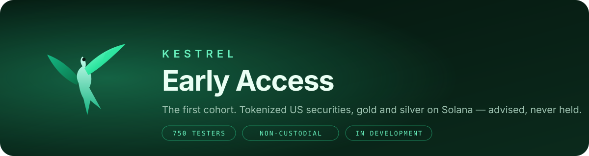

# Kestrel Early Access

Welcome to the first cohort. **750 of you** signed up to test Kestrel before it opens — this repository is your home base: what the program is, what you'll be testing, how to send feedback that actually changes the product, and the rules that keep everyone safe.

> **Where we are, plainly.** Kestrel is in development. The portfolios you see on the site are paper portfolios marked at real prices; the on-chain program (VANE) is written and under adversarial test, with an external review scheduled before it ever holds a dollar. Nothing in this program asks you to deposit funds, and nothing here is investment advice.

---

## What Kestrel is

An **agentic advisor** for tokenized US securities on Solana. You pick one of five portfolios; the engine holds it on target with drift-band rebalancing — mechanical, around the clock, never discretionary. Your assets stay in a vault only you can open. The advisor is granted exactly one power — rebalance *inside* that vault — and the program enforces that it can never do anything else.

| Portfolio | Tier | What it holds |
|---|---|---|
| **Roost** | Conservative | Half blue-chip equity, half Treasuries |
| **Perch** | Moderate | Index core, blue-chips, small metals sleeve, cash reserve |
| **Soar** | Growth | Leading tech and platforms, gold hedge, sliver of cash |
| **Apex** | Aggressive | High-growth and speculative names, fully invested, metals hedge |
| **Edge** | Memecoins | Five-name Solana basket, equal-weight, hard risk rails |

Full holdings and live tracking: [kestrelinvest.xyz/portfolios](https://kestrelinvest.xyz/portfolios.html) · Edge live: [kestrelinvest.xyz/edge](https://kestrelinvest.xyz/edge.html) · Custody: [VANE — Vault Autonomy Engine](https://kestrelinvest.xyz/vane.html)

---

## What early access gets you

- **First seat.** When the capped pilot opens, cohort members are invited first, in sign-up order.
- **A voice in the product.** Every issue filed here is read and triaged by the team. Testers who file reproducible bugs or shape a feature are credited in the changelog (handle only, never personal details).
- **The inside view.** Pilot caps, review milestones, and program-id publications land here before they land on the site.
- **Edge priority.** Edge seats open to the first cohort; $KESTREL holders in the cohort are first in line.

---

## What you'll be testing, by phase

| Phase | What's live | What we need from you |
|---|---|---|
| **1 — Now: paper** | Site, portfolio ladder, live paper trackers, Edge tracker, x402 agent access, early-access flow | Break the site. Wrong numbers, bad copy, mobile defects, confusing flows, anything that feels off. |
| **2 — Devnet** | VANE on devnet with a mock venue; open a vault, deposit test USDC, watch the engine rebalance | Try to make the advisor do something it shouldn't. Try to get your funds stuck. Report both. |
| **3 — Capped mainnet pilot** | Real vaults under a small per-vault cap and a published upgrade authority, after the external review closes | Real usage at small size. Fees, slippage, rebalance timing, dashboard truth versus chain truth. |
| **4 — Caps lift** | Limits raised in steps as the pilot proves out | Keep filing. |

You'll be told which phase is live — in this repo's changelog and by email to the address you signed up with. You will **never** be asked to move funds by any other channel.

---

## How to give feedback

1. **Bugs** → [open a bug report](../../issues/new?template=bug.yml). Include what you did, what you expected, what happened, your device/browser, and a screenshot if you have one. Never include your seed phrase, private key, or email in an issue.
2. **Ideas** → [open a feature request](../../issues/new?template=idea.yml). Say what problem it solves for you, not just what to build.
3. **Security** → do **not** open a public issue. Email **info@kestrelinvest.xyz** with "SECURITY" in the subject. We acknowledge within 48 hours. Findings against VANE's invariants are exactly what the review phase exists for.
4. **Everything else** → [Discussions](../../discussions) or the [contact page](https://kestrelinvest.xyz/contact.html).

Good reports name the page, the time (with timezone), and the steps. "It's broken" can't be fixed; "Perch tracker shows $10,117 but the holdings sum to $10,140 at 14:02 ET on mobile Safari" gets fixed that day.

---

## House rules (read these)

- **Kestrel will never DM you first, ask for your seed phrase, or ask you to send funds.** Anyone doing so in Kestrel's name is an impersonator — report them.
- Official channels are exactly: **kestrelinvest.xyz**, **@KestrelInvest** on X, **github.com/KestrelInvest**, and **info@kestrelinvest.xyz**. Nothing else.
- Test with wallets and amounts you can afford to lose. During the devnet phase, use devnet only. During the pilot, respect the cap — it exists to protect you.
- Be direct and be decent. Harsh feedback about the product is welcome; harassment of other testers is not.
- Don't share pre-release material outside the cohort until it's on the site.

---

## What we promise back

- **Honesty over hype.** Paper is labeled paper. Nothing is called "audited" or "live" until it is.
- **Your exit never closes.** In every phase with real vaults, withdraw is owner-only and can't be blocked by the advisor, a pause, or a dead keeper. That is a program invariant, not a policy.
- **You'll see the receipts.** Program ids, upgrade authority, review scope and outcome are published here and on the site.

---

## Timeline & changelog

See [CHANGELOG.md](CHANGELOG.md). Phase changes, cap changes, and review milestones are recorded there with dates.

---

Kestrel is in development. Not investment advice. Tokenized US securities via Backpack Securities, traded 24/7 on Solana. © Kestrel

